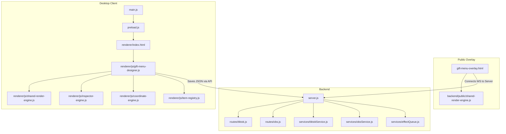

# Full Project Structure

This document provides a comprehensive mapping of the directory structure of the EffectStore application.

## Directory Overview

```
effectstore-app/
├── admin/                     # Admin configuration and tools
├── backend/                   # Node.js/Express Backend Server API & Live Services
│   ├── middleware/            # JWT authentication middleware
│   ├── models/                # MongoDB Mongoose collection models
│   ├── public/                # Static overlay pages and shared render engines
│   ├── routes/                # Express API endpoint router files
│   ├── services/              # OBS WebSocket connection, TikTok Live API connection, and Queue controllers
│   ├── uploads/               # User asset uploads directory (Goal backgrounds, video files, layout backups)
│   └── server.js / index.js   # Server orchestration and WebSocket setup
├── desktop/                   # Electron Desktop Application
│   ├── main.js                # Electron main process (IPC communication, windows setup, lifecycle)
│   ├── preload.js             # Bridge between Electron secure context and browser context
│   └── renderer/              # Frontend pages and modules
│       ├── js/                # Coordinate Engines, Item Registries, Inspectors, and Canvas Renderers
│       ├── styles/            # Designer CSS styles and UI systems
│       └── index.html / etc.  # UI markup pages
├── docs/                      # Technical specification sheets and system guidelines
└── scratch/                   # Temporary maintenance and recovery scripts
```

## Key Folders and File Responsibilities

### 1. `backend/`
Handles live streaming connections, video decryption, payments, and serving assets to overlays.
- `server.js`: Initializes Mongoose, Express, WebSocket broadcast server, and maps all Express route systems. Starts connection to OBS and TikTok services.
- `services/tiktokService.js`: Integrates with the TikTok Live API to catch incoming gifts, comments, and triggers in real time.
- `services/obsService.js`: Coordinates scene selections, filter toggles, source visibilities, and overlay rendering on OBS Studio via OBS WebSockets.
- `services/effectQueue.js`: Enqueues media triggers so that simultaneous gift effects play sequentially rather than overlapping.

### 2. `backend/public/`
The public folder serves resources to browser sources in OBS.
- `gift-menu-overlay.html`: Loaded as an OBS Browser Source. Listens to WebSockets for updates, rendering widgets (Goal lists, combo counters, stack groups) and running transitions.
- `shared-render-engine.js`: Shared JS library containing the primary rendering functions for widgets (e.g. `renderGoalBar`, `renderGiftStackGroup`). Synchronized with the desktop renderer.

### 3. `desktop/`
The local client shell wrapping the application.
- `main.js`: Boots Electron, establishes local Express/Websocket forwarding bridges, and handles IPC events for system actions (like window closures and shell launches).
- `renderer/js/gift-menu-designer.js`: Orchestrates the canvas designer editor. Handles mouse drags, selections, resizing, layers, and configuration properties.
- `renderer/js/shared-render-engine.js`: Client-side sync of the shared renderer to render preview widgets on the editor canvas dynamically.

## Core File Dependencies


