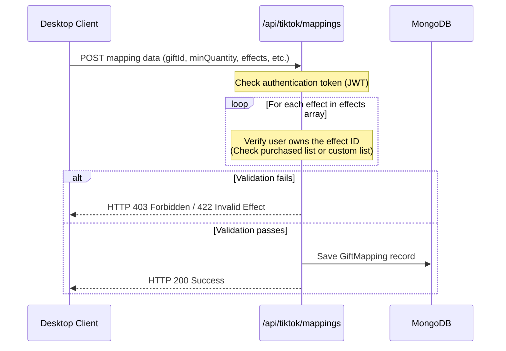

# Gift Mapping Engine Technical Reference

This document serves as the comprehensive technical specification and architectural guide for the Gift Mapping Engine in BH Studio (EffectStore).

---

## 1. Purpose & Core Logic

The Gift Mapping Engine links incoming TikTok Live socket events to visual WebM video overlays displayed on stream. Rather than simple 1-to-1 links, the engine processes conditions, limits rates, and resolves groups of effects dynamically.

---

## 2. Engine Capabilities & Trigger Rules

The engine supports several advanced trigger constraints:

### A. Multiple Effects & Playback Modes
Streamers can link a single gift to multiple effects.
*   **Ngẫu nhiên (Random)**: Chooses one random effect from the array at playback time.
*   **Tuần tự (Sequential)**: Rotates through the effects one by one using a persistent index tracked in the `PlaybackManager`.

### B. Smart Mapping Conditions (Quantity Triggers)
Filters triggers based on the quantity of gifts sent in a single event.
*   **Min Quantity**: The minimum threshold needed to fire the mapping.
*   **Max Quantity**: The maximum threshold for this mapping (optional).
*   **Exact Quantity**: Restricts the trigger to an exact count.
    *   *Example*: Mapping "Rose" with exact count `99` triggers a screen-wide heart effect. Sending `98` or `100` roses will not trigger this mapping.

### C. Cooldown Protection
Limits how frequently a mapping can be triggered to prevent spam.
*   **cooldown**: Duration (in seconds) the mapping is locked after being triggered.
*   **cooldownAction**:
    *   `queue`: Incoming spammed gifts are placed in the FIFO queue to play sequentially.
    *   `ignore`: Incoming gifts sent during the cooldown period are dropped entirely.

---

## 3. Data Schema

Mappings are persisted in MongoDB using the `GiftMapping` schema:

```javascript
const GiftMappingSchema = new mongoose.Schema({
    userId: { type: String },
    giftId: { type: String, required: true },
    giftName: String,
    giftIcon: String,
    effectId: { type: String, required: true },
    effectName: String,
    effects: [{
        effectId: { type: String },
        effectName: { type: String },
        weight: { type: Number, default: 1 }
    }],
    playbackMode: { type: String, default: 'random' },
    minQuantity: { type: Number, default: 1 },
    maxQuantity: { type: Number, default: null },
    exactQuantity: { type: Number, default: null },
    cooldown: { type: Number, default: 0 },
    cooldownAction: { type: String, default: 'queue' },
    isActive: { type: Boolean, default: true }
});
```

---

## 4. Lifecycle & Flow Logic

### Creation & Ownership Validation Flow


### Event Matching Loop (tiktokService.js)
When a gift event is received, `tiktokService.js` resolves the matches:

```javascript
// Step 1: Find all mappings for this gift ID
const mappings = await GiftMapping.find({ giftId, userId, isActive: true });

// Step 2: Filter by quantity conditions
const matchedMapping = mappings.find(m => {
    if (m.exactQuantity && quantity !== m.exactQuantity) return false;
    if (m.minQuantity && quantity < m.minQuantity) return false;
    if (m.maxQuantity && quantity > m.maxQuantity) return false;
    return true;
});

// Step 3: Check cooldown state
if (matchedMapping) {
    const isLocked = playbackManager.isMappingInCooldown(matchedMapping._id, matchedMapping.cooldown);
    if (isLocked) {
        if (matchedMapping.cooldownAction === 'ignore') {
            return; // Ignore / Drop trigger
        }
    }
    
    // Register trigger time & queue effect
    playbackManager.registerMappingTrigger(matchedMapping._id);
    await effectQueue.add({ ...item });
}
```

---

## 5. Current UI & Management Views

*   **HTML Structure ([index.html](file:///d:/effectstore-app/desktop/renderer/index.html))**:
    *   *Smart Conditions panel*: Collapsible advanced inputs (`#mapping-conditions-toggle`).
    *   *Queue Status*: A static UI component (`#queue-status-panel`) that displays the active rendering WebM title, queue length, and countdown remaining.
*   **JS Bindings ([home.js](file:///d:/effectstore-app/desktop/renderer/js/home.js))**:
    *   Supports multi-selecting effects in the sidebar list.
    *   Displays badges showing configuration indicators (e.g. `SL: >= 10`, `Chờ: 5s (Bỏ qua)`) directly on the mapping cards.
