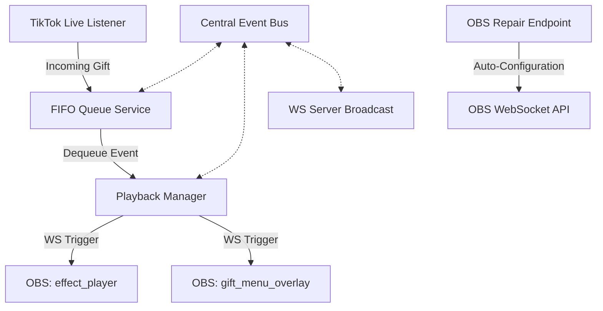

# Gift Mapping Engine Optimization Architecture

This document describes the design, implementation, and interfaces of the modernized **Live Interaction Engine** in BH Studio. The engine has been refactored from a simple `Gift → Effect` trigger system into a professional live streaming overlay pipeline.

---

## 1. System Overview

---

## 2. Core Components

### 2.1 Centralized Event Bus (`backend/services/eventBus.js`)
A Node.js `EventEmitter` hub acting as the single source of truth for the playback lifecycle. It decouples the incoming triggers (e.g. TikTok live events) from the UI polling and the WebSocket broadcasting endpoints.
*   **Key Events**:
    *   `effect_started`: Emitted when an effect starts playing.
    *   `effect_finished`: Emitted when an effect finishes or times out.
    *   `queue_updated`: Emitted whenever items are enqueued, dequeued, or when the queue state changes.
    *   `error`: Emitted when processing errors occur.

### 2.2 Playback Manager (`backend/services/playbackManager.js`)
Decouples WebSocket signaling from queue processing and handles:
*   **Rotation Policies**: Support for `random` or `sequential` playback modes when a gift is mapped to multiple effects.
*   **Active Cooldowns**: Memory cache tracking of active cooldown timers per gift mapping.
*   **Safety Timeouts**: Fallback completion callback (default 10s safety margin) triggered if the client browser or OBS connection crashes mid-playback.
*   **Overlay Synchronization**: Emits notifications to fade out overlay layers (like `gift_menu_overlay`) when a high-priority video effect starts playing and restore them once playback completes.

### 2.3 FIFO Queue Service (`backend/services/effectQueue.js`)
Manages sequence serialization in a classic first-in-first-out flow:
*   Maintains a list of pending items.
*   Triggers next item automatically once `PlaybackManager` emits `effect_finished`.
*   Includes validation constraints at `onBeforeEnqueue(item)`.

---

## 3. Configuration & Smart Conditions Schema

The `GiftMapping` database schema supports advanced logic parameters:

| Field | Type | Description |
| :--- | :--- | :--- |
| `giftId` | String | Unique identifier of the gift on TikTok. |
| `giftName` | String | Display name of the gift. |
| `effects` | Array | Group of effects mapped to this gift (containing `{ effectId, effectName }`). |
| `playbackMode` | String | `random` or `sequential` selection rule. |
| `minQuantity` | Number | Minimum quantity required to trigger the mapping. |
| `maxQuantity` | Number | Maximum quantity threshold (inclusive). |
| `exactQuantity` | Number | Triggers ONLY if the received quantity matches exactly. |
| `cooldown` | Number | Cooldown time in seconds. |
| `cooldownAction` | String | Cooldown action: `queue` (enqueue and delay) or `ignore` (silently drop). |

---

## 4. OBS Diagnostics & Repair System

Streamers frequently experience setup issues where OBS sources get accidentally deleted or renamed. The OBS Diagnostic & Repair System provides an automated recovery path:
1.  **Diagnostic Checklist**: Logs query status to check if `EffectStore` scene exists, and if browser inputs `effect_player` and `gift_menu_overlay` are configured.
2.  **Auto-Repair**:
    *   Creates the `EffectStore` scene if missing.
    *   Creates or corrects configuration URLs and local filepaths for browser inputs.
    *   Ensures consistent width, height, and hardware acceleration options.

---

## 5. UI Control Panels

### 5.1 Queue Status Panel
A real-time overview displaying the active effect name, remaining duration (seconds), sender, gift details, type of play, and count of queued effects waiting in line.

### 5.2 Mapping Configuration Panel
Exposes control inputs to streamers during mapping:
*   Multi-selection grid toggling in the effects grid.
*   Cooldown time adjustments and behavior policies.
*   Collapsible Smart Trigger conditions (Exact quantities or range brackets).
