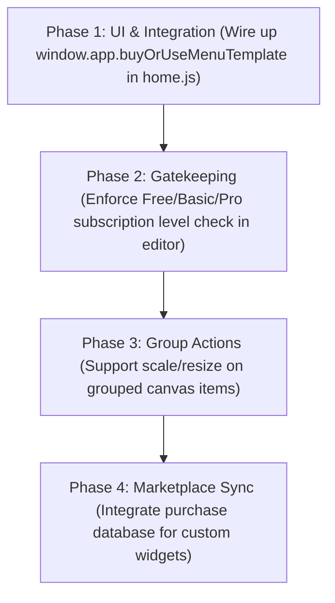

# Menu Designer Recovery Audit

## 1. Summary
Following the recent system recovery, the **Menu Designer** (implemented primarily in [gift-menu-designer.js](file:///d:/effectstore-app/desktop/renderer/js/gift-menu-designer.js) and rendered via [gift-menu-overlay.html](file:///d:/effectstore-app/backend/public/gift-menu-overlay.html)) is in a **semi-functional prototype state**. 
- The **Core Editor Canvas** is robust, supporting item movement, scaling, and z-index ordering.
- **Widgets** (Goal Bars, Circle, Boss Bar, Combo, Mystery Chests, and Goal Lists) are successfully implemented in both editor and overlay code.
- The **Template System** displays items and handles insertion, but the **Monetization & Ownership checks** are entirely missing or mock-based.
- **Tiers and Plan restrictions** (Free/Basic/Pro) are not enforced in either frontend or backend, meaning all premium options are unlocked by default.

---

## 2. Feature Inventory Table

| Feature | Exists in Code | Visible in UI | Works? | Related File/Function | Notes |
| :--- | :---: | :---: | :---: | :--- | :--- |
| **Drag & Drop Items** | Yes | Yes | Yes | `addGiftToCanvas`, drag listeners | Allows dragging gifts from library to canvas. |
| **Move Items** | Yes | Yes | Yes | Pointer down/move/up handlers | Drags active items on the workspace. |
| **Resize Items** | Yes | Yes | Yes | Resize handle rendering | Adjusts item width and height via bounds drag. |
| **Rotate Items** | Yes | Yes | Yes | `.gmd-rotate-handle` | Rotates element in editor & propagates to OBS. |
| **Layer Panel** | Yes | Yes | Yes | `renderLayerPanel` | View and select list of workspace layers. |
| **Lock/Unlock Layer** | Yes | Yes | Yes | `item.locked` check | Prevents manipulation of locked layers. |
| **Hide/Show Layer** | Yes | Yes | Yes | `item.visible !== false` | Toggle visibility state of active layers. |
| **Group Items** | Yes | Yes | Partially | `item.groupId` | Code supports tracking groups, but no UI creation flow. |
| **Move Grouped Together** | Yes | Yes | Yes | Pointer dragging with group checking | Grouped elements move together on canvas. |
| **Scale Grouped Together** | No | No | No | N/A | Dragging resize handles only scales active item. |
| **Add Text Layer** | Yes | Yes | Yes | Text item template insertion | Adds clean custom text labels to canvas. |
| **Edit Text Layer** | Yes | Yes | Yes | Text inputs in inspector panel | Edit label string in real time. |
| **Custom Text Color** | Yes | Yes | Yes | Color pickers | Supports custom RGB colors. |
| **Text Shadow** | Yes | Yes | Yes | Text shadow CSS generator | Applies drop shadows to font layers. |
| **Font Size / Alignment** | Yes | Yes | Yes | `textSize` and positioning selectors | Modifies font sizing and block alignment. |
| **Goal Bar / Circle** | Yes | Yes | Yes | `type: 'goal-bar'`, `type: 'goal-circle'` | Standard progress bars and radial counters. |
| **Boss Bar / Combo** | Yes | Yes | Yes | `type: 'boss-bar'`, `type: 'combo'` | Health-bar style goals and combo hit counters. |
| **Mystery Chest** | Yes | Yes | Yes | `type: 'mystery-chests'` | Threshold milestone icons that unlock live. |
| **Goal List Widget** | Yes | Yes | Yes | `type: 'goal-list'` | Lists multiple goals in scrollable list. |
| **Auto Scroll List** | Yes | Yes | Yes | `isAutoScroll`, `scrollDuration` | Scrolls lists vertically in editor and overlay. |
| **Shimmer Effect** | Yes | Yes | Yes | `enableShimmer` styling | Renders a shining glow line over target blocks. |
| **Custom BG / Text Color** | Yes | Yes | Yes | Background toggles / picker options | Allows custom hex backgrounds or transparent states. |
| **Podium Leaderboard** | Yes | Yes | Yes | `type: 'podium-contributors'` | 3D podium rankings (Top 1, 2, 3). |
| **Classic Leaderboard** | Yes | Yes | Yes | `type: 'top-contributors'` | List-style contributor rankings. |
| **Avatar & Value Support** | Yes | Yes | Yes | `showAvatar`, `showValue` | Displays player TikTok avatars and coins. |
| **Template Category Sidebar**| Yes | Yes | Yes | `loadTemplatesList` | Filters list sidebar by layout styles. |
| **Premium Price Tags** | Yes | Yes | Yes | `t.isPremium` and `t.price` | Shows price values in VND or "Free" tags. |
| **Monetization Blockers** | No | No | No | `buyOrUseTemplateFromSidebar` | Function calls `window.app.buyOrUseMenuTemplate` which is undefined. |
| **Plan Subscription Locks** | No | No | No | N/A | Missing logic to block Free users from premium widgets. |
| **OBS Export & Sync** | Yes | Yes | Yes | `exportToOBS` / `saveAndExport` | Saves layout and pushes webhook setup to local server. |

---

## 3. Working Features
- **Canvas Dragging & UI Layout**: The core canvas coordinates, drag-and-drop actions, snap-to-guides, zoom, and panning functions operate correctly.
- **Widget Render Engines**: All key widgets (`goal-bar`, `goal-circle`, `boss-bar`, `mystery-chests`, `goal-list`, `combo`, and the two leaderboard variations) are fully coded. They render properly in the designer canvas and scale dynamically based on active viewport ratios.
- **OBS Local Sync**: Pushing layouts via HTTP POST `/gift-menu-layout` works reliably, and the OBS renderer loads layout files correctly on initialization.

---

## 4. Code Exists But UI Not Connected
- **Monetization Handshake**: In [gift-menu-designer.js](file:///d:/effectstore-app/desktop/renderer/js/gift-menu-designer.js#L531-L537), `buyOrUseTemplateFromSidebar(templateId)` expects to trigger a payment modal on the main app via `window.app.buyOrUseMenuTemplate(templateId)`. However, `buyOrUseMenuTemplate` is **not defined** anywhere in the main application logic (`home.js`), resulting in payment attempts showing a fallback browser alert.
- **Layout Groups**: The code natively processes `groupId` properties to move grouped items concurrently, but the editor UI lacks group creation buttons (e.g. a "Group Elements" action).

---

## 5. Broken Features
- **Group Scaling**: Selecting multiple items and dragging the resize handle fails to scale grouped items proportionally; it only stretches the primary target boundary.
- **Premium Item Validation**: The database and layout editor support `isPremium: true` metadata on template objects, but neither the front-end save/export function nor the backend controllers validate user subscription levels or verify purchases before saving layouts. Any user can import, save, and use premium elements.

---

## 6. Missing Features
- **Tiers & Subscription Gatekeeping**: Expected gates for **Free** (Menu Designer Lite), **Basic** (Menu Designer Pro), and **Pro** (Advanced Designer) are missing.
- **Upgrade Prompts**: No popup panels exist to prompt users to upgrade their subscription tier when attempting to drag locked premium widgets onto the canvas.

---

## 7. OBS Export Sync Status
- **Synchronized**: Yes. The backend serves `gift-menu-overlay.html` which loads the exact JSON layout saved by the designer.
- **Scale Factor Handling**: The overlay file recalculates dimensions using a global scale factor `s` based on parent screen resolutions, ensuring responsive rendering in both 9:16 and 16:9 streams.

---

## 8. High-Risk Areas
> [!CAUTION]
> **Inspector Logic & Canvas Events**
> The event loops inside `gift-menu-designer.js` tracking mouse move positions (`pointermove`) and layout render loops (`renderCanvas`) are highly coupled. Small edits to sizing ratios or canvas offsets risk breaking pointer alignment and element selection bounds.

---

## 9. Recommended Rebuild Plan

- **Phase 1: UI & Integration**: Implement the `buyOrUseMenuTemplate` wrapper inside `home.js` to pop open the pricing modal or purchase prompt cleanly.
- **Phase 2: Subscription Gatekeeping**: Wire plan limits (Free/Basic/Pro) to widget drag-and-drop actions. Trigger an upgrade prompt when restricted components are dragged.
- **Phase 3: Group Actions**: Add canvas buttons to group/ungroup elements, and extend the pointer resize logic to recalculate scale boundaries for all sub-items in a group.
- **Phase 4: Marketplace & Templates**: Connect the custom template save API to a secure database verification flow on the backend.
