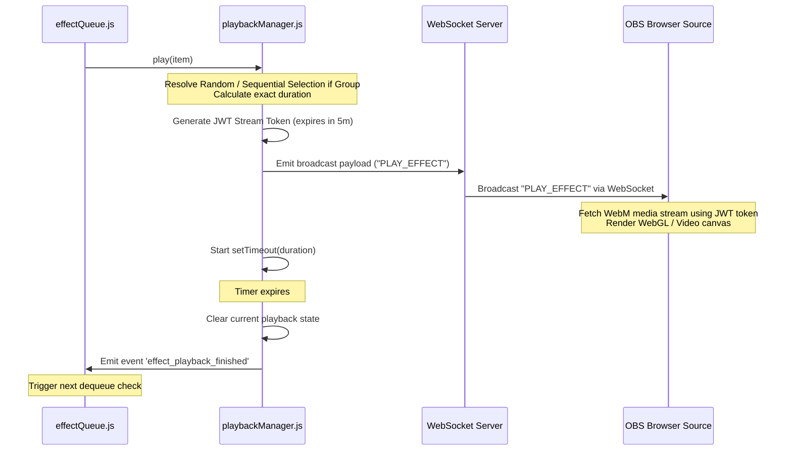
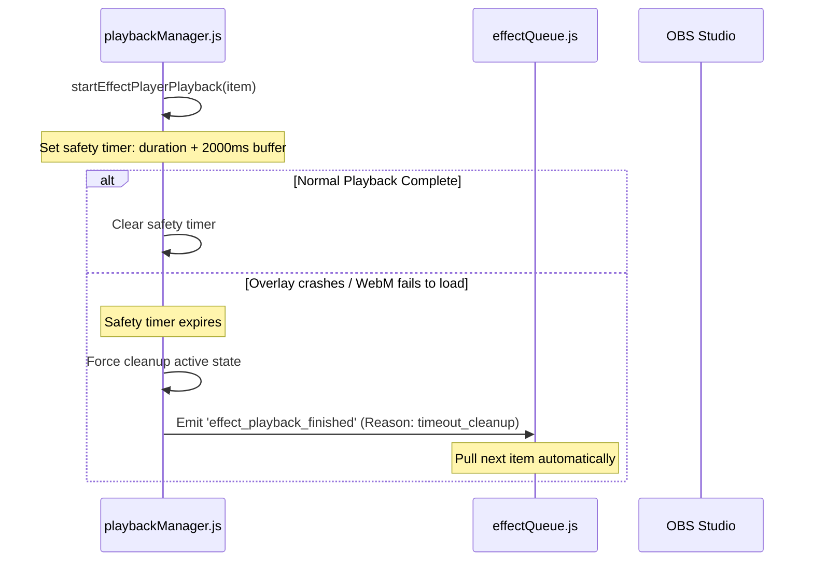
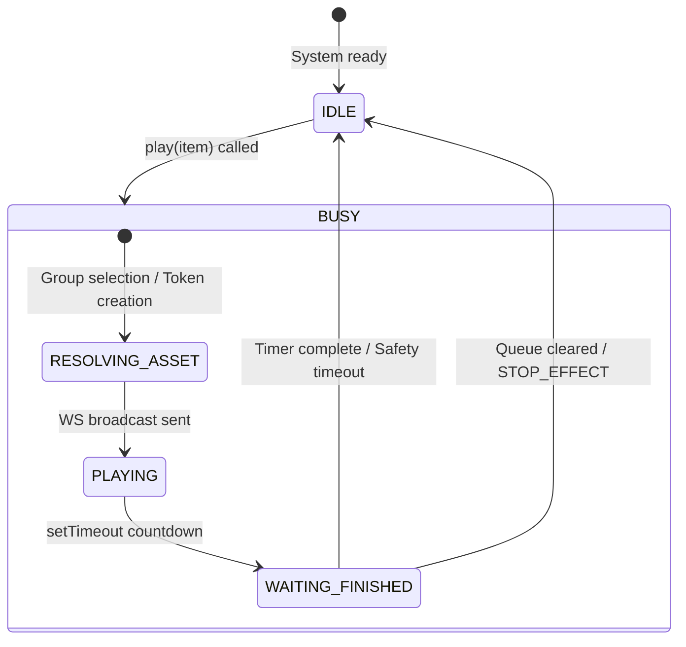

# Playback Pipeline & Event Flows

This document details every playback path in BH Studio. It outlines how previews, tests, simulated events, and live streams resolve, queue, trigger, and finish playing media on the OBS overlay screen.

---

## 1. Core Playback Lifecycle

All visual alert actions in BH Studio follow this unified chain:

```
[Trigger Source] 
       ↓
[Payload Normalizer / Validator] 
       ↓
[FIFO Queue / effectQueue.js] 
       ↓
[Playback Manager / playbackManager.js] 
       ↓ (WS Broadcast "PLAY_EFFECT" with JWT Stream Token)
[Browser Overlay / effect_player.html] 
       ↓
[OBS Scene Rendering / WebM Canvas]
       ↓ (Timer Duration Expiration OR Finish Event Notification)
[Playback Finished Trigger]
       ↓
[De-queue next item]
```

---

## 2. Playback Path Matrix

| Path | Input Event | Playback Type | Authorization | Playback Channel |
| :--- | :--- | :--- | :--- | :--- |
| **Store Preview** | Admin/User click preview | `preview_effect` | JWT Stream Token | Overlay (Local Web Canvas / App) |
| **Gift Mapping Test** | UI click "Test" | `test_mapping` | JWT Stream Token | OBS Studio (WebSocket Broadcast) |
| **Simulated Gift** | UI click "Simulate" | `live_mapping` | JWT Stream Token | OBS Studio (WebSocket Broadcast) |
| **Real TikTok Gift** | Incoming TikTok Socket | `live_mapping` | JWT Stream Token | OBS Studio (WebSocket Broadcast) |

---

## 3. Sequence Flows

### A. Dynamic Resolution and Playback (Successful Run)

When an item is ready to play, `PlaybackManager` resolves group mappings, generates the media stream token, and sends a WebSocket message.



### B. Failure & Timeout Path

If the browser overlay fails or does not respond, a safety fallback timer prevents the queue from locking up.



---

## 4. WebSockets & Event Reference

The system uses standard WebSockets (port 9001) for real-time overlay notifications.

### WebSocket Outbound Events (Server -> Overlay / Client)

#### 1. `PLAY_EFFECT`
Sent to OBS Overlays to start rendering a WebM media file.
*   **Payload**:
    ```json
    {
      "type": "PLAY_EFFECT",
      "effectId": "custom-1783065014051-cfayu4dcve",
      "effectUrl": "http://localhost:9000/api/obs/effect-player-media/custom-1783065014051-cfayu4dcve?token=JWT_STRING",
      "duration": 6000,
      "playbackType": "test_mapping"
    }
    ```

#### 2. `STOP_EFFECT`
Sent to immediately interrupt rendering (e.g., when the queue is cleared).

#### 3. `QUEUE_UPDATE`
Sent to notify desktop clients of the queue length and status.

---

## 5. Queue State Machine

The playback state transitions follow a strict sequence managed by `playbackManager.js` and `effectQueue.js`.


