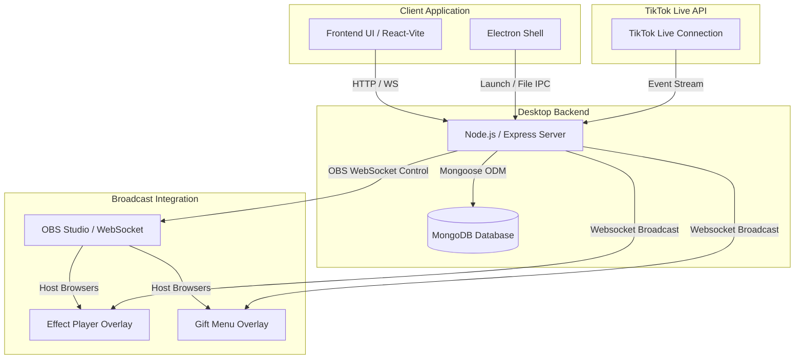
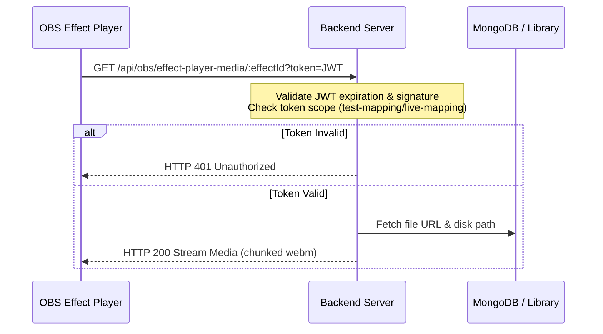
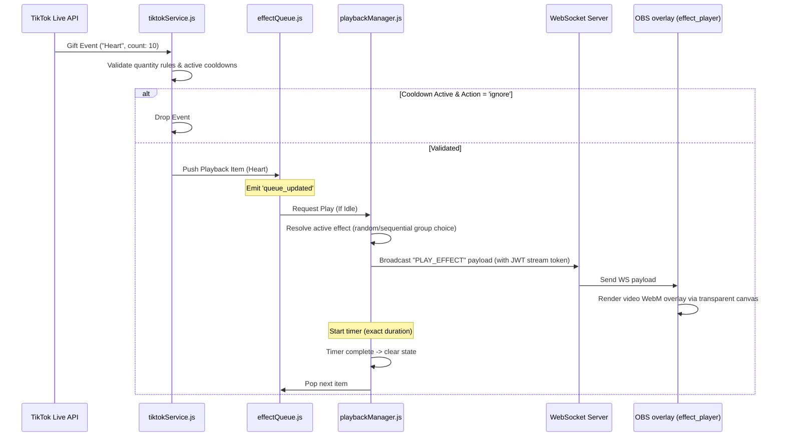

# Project Architecture Current (Snapshot)

This document provides a comprehensive overview of the current architecture of BH Studio (EffectStore). It acts as the technical source of truth for the system's design, modular boundaries, service boundaries, and data pipelines.

---

## 1. Overall Architecture

BH Studio is an Electron-based desktop application paired with an Express/Node.js backend and a MongoDB database. The core purpose of the system is to capture TikTok Live events (gifts, interactions) and render overlay effects onto OBS (Open Broadcaster Software).



### Components:
*   **Backend**: A Node.js Express server running locally (port 9000). Handles business logic, database mutations, OBS WebSocket synchronization, TikTok Live streams, and serving overlay assets.
*   **Frontend**: A web UI served by the local server and rendered in Electron or standard browsers. Built with Vite and modern JS.
*   **Electron**: A desktop shell wrapper that launches the local server, manages OS integrations, and opens native app windows.
*   **OBS Studio**: Receives WebGL/video overlays via OBS Browser Sources (`effect_player` and `gift_menu_overlay`). Controlled programmatically via OBS WebSocket (port 4455).
*   **TikTok Live Integration**: Connects directly to TikTok Live using a background stream listener. Translates live socket events into localized playback items.
*   **Marketplace**: Offers a built-in catalog of effects that users can browse, preview, and purchase.
*   **Subscription**: A subscription-based permission layer restricting custom effect uploads and advanced mapping settings based on the user's tier.
*   **Gift Mapping Engine**: Binds TikTok Gift IDs to single or grouped WebGL/video effects with custom trigger rules (cooldowns, quantities, modes).
*   **Playback Pipeline**: A centralized manager resolving selected assets, authenticating requests via JWT stream tokens, and notifying OBS layers.
*   **Effect Player**: A chroma-keyed WebGL/video overlay canvas rendered inside OBS Browser Sources to display alerts and transparent webm files.
*   **Gift Menu**: A floating interactive overlay menu that displays user-designed layouts dynamically.
*   **Menu Designer**: An interactive grid system used to build and customize floating gift menu styles and save them to the database.
*   **Goal Board**: A visual overlay indicator tracking custom targets (e.g. Gift goals).
*   **Admin Dashboard**: Administration view for managing global effects, users, payments, and system configurations.
*   **Database**: Local MongoDB database instance storing users, mappings, logs, preferences, and subscriptions.
*   **API**: REST API layer for client actions (mappings, store purchases, settings).
*   **WebSocket**: Separate socket server (port 9001) facilitating real-time UI/Overlay updates.
*   **Overlay**: Web-based renderer pages loaded into OBS Studio (configured as transparent chroma-key containers).
*   **Authentication**: JWT-based authentication protecting API routes, WebSockets, and stream links.

---

## 2. Folder Structure

```
d:\effectstore-app\
├── backend\                   # Desktop Backend Server
│   ├── config\                # System definitions, routes mapping, plans configuration
│   ├── middleware\            # Authentication filters
│   ├── models\                # Mongoose Database Schemas
│   ├── public\                # Exposed media assets
│   ├── routes\                # REST API Endpoint Routers
│   ├── services\              # Singletons managing OBS, TikTok, Playback, and Queues
│   ├── index.js               # Application Entrypoint
│   └── server.js              # Express and WebSocket initialization logic
├── desktop\                   # Electron Container Application
│   ├── main.js                # Main process lifecycle manager
│   └── renderer\              # Desktop UI and local views
│       ├── css\               # CSS Stylesheets
│       ├── js\                # View-specific scripts (home, gift-menu-designer, etc.)
│       ├── views\             # HTML template pages
│       └── index.html         # Main Client Window Layout
├── docs\                      # Technical documentation
└── effects\                   # Downloaded/Temporary WebM effects storage
```

---

## 3. Core Services & Responsibilities

*   **[eventBus.js](file:///d:/effectstore-app/backend/services/eventBus.js)**: Central event mediator. De-couples queue processors from playback controllers by communicating asynchronously via events (`effect_playback_started`, `effect_playback_finished`, `queue_updated`).
*   **[playbackManager.js](file:///d:/effectstore-app/backend/services/playbackManager.js)**: Orchestrates active OBS render items. Determines dynamic group mapping rotations (random/sequential), resolves security media stream tokens, initiates client-side WS play signals, tracks active cooldown timers, and triggers queue continuation via timeouts.
*   **[effectQueue.js](file:///d:/effectstore-app/backend/services/effectQueue.js)**: A FIFO array-backed queue storing pending alerts. Subscribes to the `eventBus` to automatically pop and dispatch the next item when the `PlaybackManager` becomes free.
*   **[obsService.js](file:///d:/effectstore-app/backend/services/obsService.js)**: Controls the OBS WebSocket connection. Manages self-healing checks and exposes the `/api/obs/repair-sources` endpoint to programmatically rebuild missing browser sources (`effect_player` and `gift_menu_overlay`) inside the active OBS scene.
*   **[tiktokService.js](file:///d:/effectstore-app/backend/services/tiktokService.js)**: Listens to incoming TikTok socket feeds, resolves matches against user-defined mapping records, checks quantity and cooldown rules, and passes actions to `effectQueue`.
*   **[effectLibraryService.js](file:///d:/effectstore-app/backend/services/effectLibraryService.js)**: Resolves effect files, permissions, and duration metadata for both purchased store assets and custom user uploads.

---

## 4. Current Communication Pipelines & Data Flows

### A. Dynamic Media Retrieval Flow (JWT Protection)
The system prevents raw static folder paths from leaking to browsers. Standard media links are served via a dynamic streaming endpoint that validates temporary JWT tokens.



### B. Live TikTok Gift Flow


---

## 5. Known Technical Debt

1.  **Monolithic home.js**: Client-side bindings in `desktop/renderer/js/home.js` exceed 4,000 lines. View toggling, mapping configurations, API requests, logs, categories, and timers are managed in a single file, making it a candidate for code splitting.
2.  **Local Dev Host Bindings**: The backend server hardcodes `localhost` or `127.0.0.1` strings for WebSockets and streaming. This requires streamers to run OBS on the same physical machine as Electron. Remote OBS integration requires network binding refactoring.
3.  **Local ID Parsing**: Custom effect IDs use the prefix `custom-` prefix, while system effects use MongoDB ObjectIds. This string distinction is handled ad-hoc in routes and service functions, rather than via a clean polymorphism layer.
