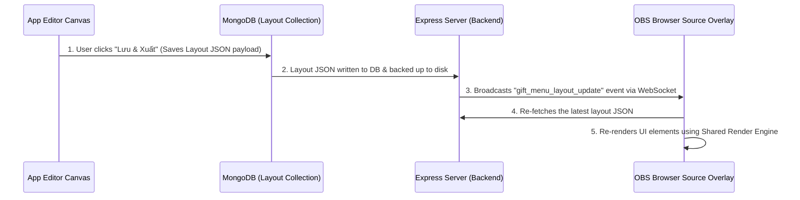

# Renderer vs OBS Synchronization Analysis

This document details the synchronization, serialization, and rendering differences between the App Editor Canvas and the OBS Browser Source Overlay.

---

## 1. Synchronization Flow

---

## 2. Render Engines Compared

| Component | App Editor Canvas | OBS Overlay |
| :--- | :--- | :--- |
| **Sizing Method** | Stage width scaled visually (`scaleX`, `scaleY`) inside container wrapper | Absolute resolution width (`exportW * scale`) for crisp text rendering |
| **Layout Mode** | Edit mode (interactive handles, selection borders) | Production overlay mode (events, auto-scrolling active, interactive layers disabled) |
| **Rendering Code** | Calls `MenuDesignerSharedRenderEngine.renderByType(item, { scale: 1 })` | Calls `window.MenuDesignerSharedRenderEngine.renderByType(item, { scale: s })` |
| **Marquee Loop** | Enabled (runs on canvas track at `scale: 1`) | Enabled (runs on overlay track at `scale: s`) |

---

## 3. Potential Mismatches & Solved Issues

### Double-Scaling Bug (Editor Canvas)
- **Problem**: When rendering widgets in the canvas, if the container applied a CSS `scale` transform AND the render engine multiplied font sizes by `scaleX`, the content scaled down twice, rendering microscopic.
- **Solution**: Set the render engine options parameter `scale: 1` inside `gift-menu-designer.js`, letting the CSS transform handle all canvas resizing.

### Border Animation Frozen / Repeating in OBS
- **Problem**: OBS browsers (older CEF versions) do not support the `pathLength` attribute on `<rect>` SVG elements, causing the Running Light border to freeze. Furthermore, when using `vector-effect="non-scaling-stroke"`, the dash array repeats based on screen pixels rather than viewBox coordinates, creating multiple tiny dashes instead of one long streak.
- **Solution**: Converted all border elements from `<rect>` to `<path>` (which CEF supports fully) and calculated the perimeter in screen pixels dynamically (`2 * (renderedW + renderedH)`) to compute absolute dash arrays, forcing exactly one long, synced glowing line.

### Overrides Clipping Stack Children
- **Problem**: Standalone export items in OBS overlay are styled with `.gmd-export-item .gmd-visual { width: 100% !important; height: 100% !important; }`. Since the Gift Stack Group is also classified as `.gmd-export-item`, this rule overrode the size of all inner children, making icons overlap.
- **Solution**: Restructured the overlay CSS stylesheet selectors to use child combinators (`>`), ensuring only top-level standalone visual layers receive these overrides.

### Standalone Gift Text Background Mismatch
- **Problem**: Standalone gifts referenced the same animation names as stack-group labels, but the required keyframes and Mystic Frame pseudo-border existed only inside the stack-group renderer. Glass, Mystic, Hologram and Light Sweep therefore differed or appeared static outside a group.
- **Solution**: Added shared label effect keyframes and `.gmd-gift-label-text-wrap` styling to both desktop and OBS CSS. The desktop preview helper and both shared render engines now produce the same padding, blur, borders, shadows, morphing and glow behavior.

### Mystic Frame Gradient Contract
- **Previous behavior**: The border derived a second color automatically from one Aura color.
- **Current behavior**: The layout stores `textBgGradientFrom` and `textBgGradientTo`. Both standalone gifts and group children render a 135-degree two-color gradient and derive their inner border/glow colors from the same pair.
- **Fallback**: Existing layouts without these fields use `#a855f7` → `#22d3ee`.

### Test Gift Isolation
- **App test path**: Renders the received-gift simulation locally for configuration feedback.
- **OBS path**: Does not receive the designer's test event. OBS reactions remain reserved for genuine gift events from the TikTok Live connector.

### Media Compatibility
- Accepted designer upload formats are PNG, GIF and WebM.
- PNG/GIF/WebM optimization is performed according to media type before use, reducing dimensions/frame load or video bitrate where appropriate.
- Both shared render engines detect WebM and render it as a muted, looping inline video; PNG/GIF remain image elements.
